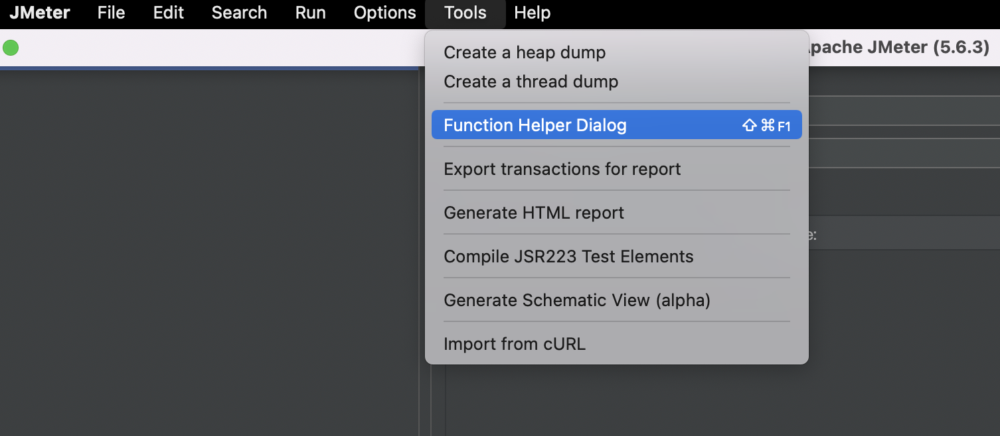
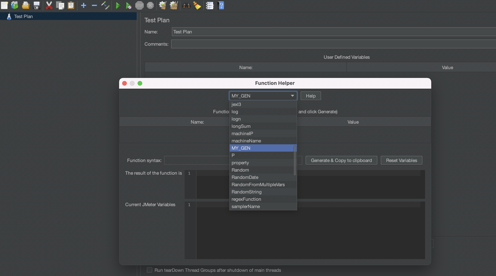
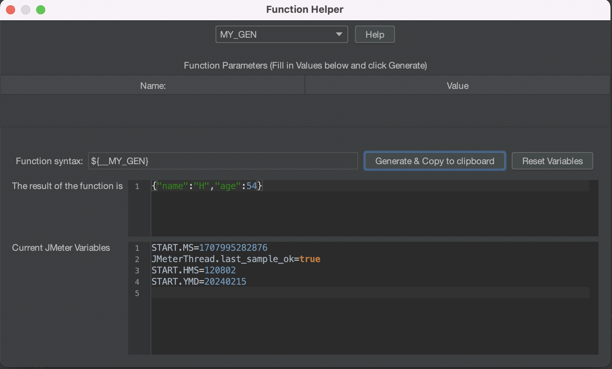
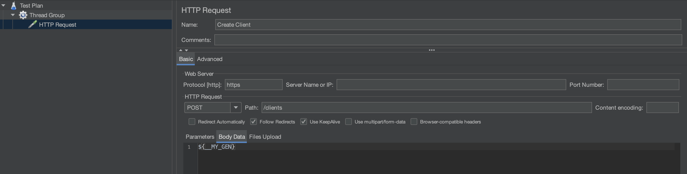

[](https://www.buymeacoffee.com/imrafaelmerino)

[](https://search.maven.org/artifact/com.github.imrafaelmerino/java-fun/3.0.0/jar)

"_When in doubt, use brute force._" **Ken Thompson**

-   [Goal](#goal)
-   [Pseudo Random Generators](#prg)
    -   [Primitive Types Generators](#ptg)
    -   [Collection Generators](#cg)
    -   [Tuples and Record Generators](#trg)
    -   [Combinators](#com)
    -   [Objects Generators](#og)
    -   [Recursive generators](#rg)
    -   [Useful and common patterns](#ucp)
    -   [Using generators in JMeter Test Plans](#jmeter)
-   [Optics](#optics)
-   [Installation](#inst)
-   [Related projects](#rp)

## <a name="goal"><a/> Goal

The primary objective of java-fun is to bring essential Functional Programming (FP) patterns to the
Java ecosystem. Unlike mere translations of these patterns from other languages, java-fun is
designed with the intent that any typical Java developer can effortlessly embrace and comprehend
these concepts. The emphasis is on preserving the essence of these patterns, ensuring developers do
not become entangled in unfamiliar types and conventions.

Here are the key concepts that have been thoughtfully implemented within **java-fun**:

-   **Pseudo Random Generators**: Property-Based Testing is a highly effective testing approach, and
    having a robust set of generators that can be composed in countless ways is crucial.
    **java-fun** simplifies this process, making it incredibly straightforward.

-   **Optics**: In functional programming, optics take precedence over traditional getters and
    setters. They offer safety and composability, eliminating the likelihood of encountering
    NullPointerExceptions when used correctly.

-   **Tuples**: Although Java may not officially support tuples, they remain valuable. **java-fun**
    introduces tuples with arities of two and three.In the same vein that lambdas represent nameless
    functions, tuples can be seen as records lacking names. There are situations where assigning
    names becomes more cumbersome than beneficial...

## <a name="prg"><a/> Pseudo Random Generators

Pseudorandom number generators (PRNs) play a vital role in practical scenarios due to their rapid
number generation capabilities and the ability to produce reproducible results. These attributes are
particularly valuable in testing contexts.

In **java-fun**, we represent a PRN with the `Gen` type:

```code
import fun.gen.Gen;

import java.util.RandomGenerator;

public interface Gen<O> extends Function<RandomGenerator, Supplier<O>> {
}
```

Here, a `Gen` is essentially a function that accepts a `Random` seed and yields a lazy computation
of type `O`. The lazy nature of these computations is essential for seamless generator composition.

To create generators, you have access to two fundamental static factory methods:

-   **arbitrary**: This method produces generators that offer a uniform distribution of values.
-   **biased**: This method generates values with varying probabilities, giving higher probabilities
    to values that are known to trigger more bugs in our code. This is a crucial aspect of
    Property-Based Testing.

While you can create custom generators by implementing the `Gen` interface, **java-fun** provides a
plethora of predefined generators for your convenience. Let's delve into these predefined
generators.

### <a name="ptg"><a/> Primitive Types Generators

In `java-fun`, we provide a range of generators for primitive data types to facilitate
Property-Based Testing. These generators are crucial for efficient testing and come in various
flavors. Let's explore them in detail:

#### **String Generators**

-   **Bounded String Biased Generator**: This generator is biased towards producing specific string
    values. It generates the empty string, blank strings, and strings of lengths within the
    specified range with higher probability, making it useful for focusing on scenarios prone to
    bugs.

    ```code
    Gen<String> gen = StrGen.biased(int minLength, int maxLength);
    ```

    For instance:

    ```code
    Gen<String> gen = StrGen.biased(0, 3);
    ```

    This might produce strings like "", " ", or any string of length from zero to three, composed of
    valid printable Unicode characters.

-   **Bounded String Arbitrary Generators**: These generators produce strings of lengths uniformly
    distributed within the specified range `[minLength, maxLength]`. Unlike the biased generator,
    all values within this range are generated with equal probability.

    ```code
    Gen<String> gen = StrGen.arbitrary(int minLength, int maxLength);
    ```

    Other types of bounded string arbitrary generators include:

    ```code
    Gen<String> gen = StrGen.alphanumeric(int minLength, int maxLength);
    Gen<String> gen = StrGen.alphabetic(int minLength, int maxLength);
    Gen<String> gen = StrGen.letters(int minLength, int maxLength);
    Gen<String> gen = StrGen.digits(int minLength, int maxLength);
    Gen<String> gen = StrGen.ascii(int minLength, int maxLength);
    ```

#### **Integer Generators**

-   **Unbounded Integer Biased Generator**: This generator focuses on producing specific integer
    values with higher probability. It generates zero, `Byte.MAX_VALUE`, `Byte.MIN_VALUE`,
    `Short.MAX_VALUE`, `Short.MIN_VALUE`, `Integer.MAX_VALUE`, and `Integer.MIN_VALUE`.

    ```code
    Gen<Integer> gen = IntGen.biased();
    ```

-   **Bounded Integer Biased Generator**: Similar to the unbounded version, this generator produces
    values within the specified interval `(min, max)` with a higher probability.

    ```code
    Gen<Integer> gen = IntGen.biased(int min, int max);
    ```

-   **Unbounded Integer Arbitrary Generator**: This generator produces any integer number with the
    same probability, following a uniform distribution.

    ```code
    Gen<Integer> gen = IntGen.arbitrary();
    ```

-   **Bounded Integer Arbitrary Generator**: Similar to the unbounded version, this generator
    produces integers between `min` and `max` (inclusive) with the same probability, following a
    uniform distribution.

    ```code
    Gen<Integer> gen = IntGen.arbitrary(int min, int max);
    ```

#### **Long Generators**

-   **Unbounded Long Biased Generator**: This generator focuses on producing specific long values
    with higher probability. It generates values such as zero, `Byte.MAX_VALUE`, `Byte.MIN_VALUE`,
    `Short.MAX_VALUE`, `Short.MIN_VALUE`, `Integer.MAX_VALUE`, `Integer.MIN_VALUE`,
    `Long.MIN_VALUE`, and `Long.MAX_VALUE`.

    ```code
    Gen<Long> gen = LongGen.biased();
    ```

-   **Bounded Long-Biased Generator**: Similar to the unbounded version, this generator produces
    values within the specified interval `(min, max)` with a higher probability.

    ```code
    Gen<Long> gen = LongGen.biased(long min, long max);
    ```

-   **Unbounded Long Arbitrary Generator**: This generator produces any positive long number with
    the same probability, following a uniform distribution.

    ```code
    Gen<Long> gen = LongGen.arbitrary();
    ```

-   **Bounded Long Arbitrary Generator**: Similar to the unbounded version, this generator produces
    long integers between `min` and `max` (inclusive) with the same probability, following a uniform
    distribution.

    ```code
    Gen<Long> gen = LongGen.arbitrary(long min, long max);
    ```

#### **Double Generators**

-   **Unbounded Double Biased Generator**: This generator focuses on producing specific double
    values with higher probability. It generates values such as zero, `Byte.MAX_VALUE`,
    `Byte.MIN_VALUE`, `Short.MAX_VALUE`, `Short.MIN_VALUE`, `Integer.MAX_VALUE`,
    `Integer.MIN_VALUE`, `Long.MIN_VALUE`, `Long.MAX_VALUE`, `Double.MIN_VALUE`, and
    `Double.MAX_VALUE`.

    ```code
    Gen<Double> gen = DoubleGen.biased();
    ```

-   **Bounded Double-Biased Generator**: Similar to the unbounded version, this generator produces
    values within the specified interval `(min, max)` with a higher probability.

    ```code
    Gen<Double> gen = DoubleGen.biased(double min, double max);
    ```

-   **Unbounded Double Arbitrary Generator**: This generator produces any double number with the
    same probability, following a uniform distribution.

    ```code
    Gen<Double> gen = DoubleGen.arbitrary();
    ```

-   **Bounded Double Arbitrary Generator**: Similar to the unbounded version, this generator
    produces double numbers between `min` and `max` (inclusive) with the same probability, following
    a uniform distribution.

    ```code
    Gen<Double> gen = DoubleGen.arbitrary(double min, double max);
    ```

#### **Big Integer and Big Decimal Generators**

-   **Unbounded BigInteger Biased Generator**: This generator focuses on producing specific big
    integer values with higher probability: `Integer.MAX_VALUE + 1`, `Integer.MIN_VALUE -1`,
    `Long.MIN_VALUE - 1`, `Long.MAX_VALUE + 1`, and zero. It also produces big integer numbers of 64
    bits uniformly distributed.

    ```code
    Gen<BigInteger> gen = BigIntGen.biased();
    ```

-   **Bounded BigInteger-Biased Generator**: Similar to the unbounded version, this generator
    produces values within the specified interval `(min, max)` with a higher probability.

    ```code
    Gen<BigInteger> gen = BigIntGen.biased(BigInteger min, BigInteger max);
    ```

-   **Unbounded BigInteger Arbitrary Generator**: This generator produces any big integer number of
    64 bits with the same probability, following a uniform distribution.

    ```code
    Gen<BigInteger> gen = BigIntGen.arbitrary();
    ```

-   **Bounded BigInteger Arbitrary Generator**: Similar to the unbounded version, this generator
    produces big integer numbers between `min` and `max` (inclusive) with the same probability,
    following a uniform distribution.

    ```code
    Gen<BigInteger> gen = BigIntGen.arbitrary(BigInteger min, BigInteger max);
    ```

-   **Bounded Decimal-Biased Generator**: Similar to the unbounded version, this generator produces
    values within the specified interval `(min, max)` with a higher probability.

    ```code
    Gen<BigDecimal> gen = BigDecGen.biased(BigDecimal min, BigDecimal max);
    ```

-   **Unbounded Decimal Arbitrary Generator**: This generator produces any decimal number with the
    same probability, following a uniform distribution.

    ```code
    Gen<BigDecimal> gen = BigDecGen.arbitrary();
    ```

-   **Bounded Decimal Arbitrary Generator**: Similar to the unbounded version, this generator
    produces decimal numbers between `min` and `max` (inclusive) with the same probability,
    following a uniform distribution.

    ```code
    Gen<BigDecimal> gen = BigDecGen.arbitrary(BigDecimal min, BigDecimal max);
    ```

#### **Other Primitive Generators**

-   **Byte Generator**: This generator creates byte arrays with lengths biased or uniformly
    distributed within specified ranges.

```code

    Gen<byte[]> gen = BytesGen.biased(int minLength, int maxLength);
    Gen<byte[]> gen = BytesGen.arbitrary(int minLength, int maxLength);

```

-   **Character Generator**: Various character generators are available, including arbitrary
    characters, characters within specified ranges, alphanumeric characters, alphabetic characters,
    letters, digits, and ASCII characters.

    ```code
    Gen<Character> gen = CharGen.arbitrary();
    Gen<Character> gen = CharGen.arbitrary(char min, char max);
    Gen<Character> gen = CharGen.alphanumeric();
    Gen<Character> gen = CharGen.alphabetic();
    Gen<Character> gen = CharGen.letter();
    Gen<Character> gen = CharGen.digit();
    Gen<Character> gen = CharGen.ascii();
    ```

-   **Boolean Generator**: This generator produces true or false values with equal probability.

    ```code
    Gen<Boolean> gen = GenBool.arbitrary();
    ```

-   **Instant Generator**: For generating Instant values, both biased and arbitrary generators are
    available. The biased generators focus on specific Instant values, while the arbitrary
    generators provide uniform distribution.

    ```code
    Gen<Instant> gen = InstantGen.biased();
    Gen<Instant> gen = InstantGen.biased(long min, long max);
    Gen<Instant> gen = InstantGen.arbitrary();
    Gen<Instant> gen = InstantGen.arbitrary(long min, long max);
    ```

These comprehensive primitive type generators enable you to perform thorough Property-Based Testing
with ease and precision.

### <a name="cg"><a/> Containers Generators

In `java-fun`, we provide generators for container types like lists, sets, and maps. These
generators allow you to create diverse test data for various scenarios. Let's explore them in
detail:

#### **List Generator**

-   **Bounded List Biased Generator**: This generator produces lists of type `List<T>` with a bias
    towards specific values. You can specify the minimum and maximum lengths for the generated
    lists.

    ```code
    Gen<List<T>> gen = ListGen.biased(Gen<T> gen, int minLength, int maxLength);
    ```

-   **Bounded List Arbitrary Generator**: Similar to the biased generator, this generator produces
    lists of type `List<T>` within the specified length range. However, all values within this range
    are generated with equal probability.

    ```code
    Gen<List<T>> gen = ListGen.arbitrary(Gen<T> gen, int minLength, int maxLength);
    ```

-   **List of N Generator**: This generator creates lists of type `List<T>` with a fixed size `size`
    using the provided generator `gen`.

    ```code
    Gen<List<T>> gen = ListGen.ofN(Gen<T> gen, int size);
    ```

#### **Set Generator**

-   **Set of N Generator**: This generator creates sets of type `Set<T>` with a fixed size `size`
    using the provided generator `gen`. If the generator cannot produce enough distinct elements, it
    will fail after 10 times the specified size.

    ```code
    Gen<Set<T>> gen = SetGen.ofN(Gen<T> gen, int size);
    ```

    You can also create a new generator with a different number of tries using the method
    `withMaxTries`.

#### **Map Generator**

-   **Map Generator**: This generator creates maps of type `Map<K, V>` with a specified size `size`.
    You need to provide key and value generators, and it ensures that keys are distinct. If the key
    generator cannot produce enough distinct keys, it will fail after 10 times the specified size
    (customized with the method `withMaxTries`)

    ```code
    Gen<Map<K, V>> gen = MapGen.of(Gen<K> keyGen, Gen<V> valueGen, int size);
    ```

### <a name="trg"><a/> Tuples and Record Generators

`java-fun` also provides generators for tuples and record-like structures.

#### **Pair Generator**

-   **Pair Generator**: This generator creates pairs of type `Pair<A, B>` using the provided
    generators for elements `A` and `B`.

    ```code
    Gen<Pair<A, B>> gen = PairGen.of(Gen<A> _1, Gen<B> _2);
    ```

#### **Triple Generator**

-   **Triple Generator**: This generator creates triples of type `Triple<A, B, C>` using the
    provided generators for elements `A`, `B`, and `C`.

    ```code
    Gen<Triple<A, B, C>> gen = TripleGen.of(Gen<A> _1, Gen<B> _2, Gen<C> _3);
    ```

#### **Record Generator**

-   **Record Generator**: A record is a structured data type with named fields and their associated
    values. In `java-fun`, you can create record-like structures using the `MyRecordGen` generator. This
    generator allows you to define fields and associated generators, making it easy to generate
    structured data.

    ```code
    Gen<MyRecord> person = MyRecordGen.of(name, StrGen.arbitrary(1, 20),
                                          age, IntGen.biased(0, 150),
                                          birthdate, InstantGen.arbitrary()
                                         );
    ```

    The `fun.gen.MyRecordGen` class functions as a `Map<String, ?>` to store generated data and provides
    convenient access to field values without requiring explicit type conversions. Record generators
    are highly versatile and useful for creating custom object generators using the function map.
    Find an example [here](#og).

### <a name="com"><a/> Combinators

`java-fun` offers various combinator functions to enhance the capabilities of generators.

-   **OneOf Combinator**: The `oneOf` combinator selects one generator from a list of generators.
    All generators in the list have the same probability of being chosen, and they operate
    independently.

    ```code
    Gen<A> gen = Combinators.oneOf(Gen<? extends A> gen, Gen<? extends A>... others);
    ```

    Alternatively, you can pass a list of values instead of generators:

    ```code
    Gen<A> gen = Combinators.oneOf(List<A> values);
    ```

    Or use varargs:

    ```code
    Gen<A> gen = Combinators.oneOf(A value, A... others);
    ```

-   **Freq Combinator**: The `freq` combinator is similar to `oneOf`, but it allows you to assign
    different weights (probabilities) to each generator, controlling their chances of being
    selected.

    ```code
    Combinators.freq(Pair<Integer, Gen<? extends A>> freq, Pair<Integer, Gen<? extends A>>... others);
    ```

    For example, you can generate strings with a 75% probability and booleans with a 25%
    probability:

    ```code
    Combinators.freq(Pair.of(3, StrGen.biased(0, 10)), Pair.of(1, BoolGen.arbitrary()));
    ```

-   **Nullable Combinator** : The `nullable` combinator introduces the possibility of generating
    `null` values in your data. It is particularly useful for catching potential
    `NullPointerException` issues.

    ```code
     Combinators.nullable(Gen<O> gen)

     //custom probability for null values
     Combinators.nullable(Gen<O> gen,
                          int prob)
    ```

-   **nOf Combinator**: pick n elements randomly from a list or set.

    ```code
     Gen<List<O>> nListGen =  Combinators.nOf(List<O> list,
                                              int n);

     Gen<Set<T>> nSetGen =  Combinators.nOf(Set<O> set,
                                            int n)
    ```

-   **subsets and combinations Combinator**: They generate all possible subsets and n-combinations.

    ```code
     Gen<List<O>> comb = Combinators.combinations(int n,
                                                  List<O> set);

     Gen<Set<O>> subsets =  Combinators.subsets(Set<O> set)
    ```

-   **shuffle Combinator**:

    ```code
     Gen<List<O>> gen = Combinators.shuffle(List<O> list);

    ```

### <a name="og"><a/> Objects generators

This section on "Objects Generators" explains how to create generators for custom objects in your
model using `MyRecordGen` and the function map. Let's delve deeper into this process:

Consider you have a class `User` with fields `login`, `name`, and `password`. You want to generate
instances of this class with various values for testing purposes.

```code
public class User {
    String login;
    String name;
    String password;

    public User(String login, String name, String password) {
        this.login = login;
        this.name = name;
        this.password = password;
    }

    // Additional methods like toString, equals, hashCode, getters, etc.
}
```

Now, you can create a generator for the `User` class as follows:

1. Define generators for the individual fields of the `User` class, such as `login`, `password`, and
   `name`. These generators determine the values of each field.

    ```code
    Gen<String> loginGen = StrGen.alphabetic(0, 100);
    Gen<String> passwordGen = StrGen.biased(0, 100);
    Gen<String> nameGen = StrGen.alphabetic(0, 100);
    ```

2. Create a `User` generator using `MyRecordGen`:

    ```code
    Gen<User> userGen = MyRecordGen.of("login", loginGen,
                                       "name", nameGen,
                                       "password", passwordGen)
                                   .map(record -> new User(record.getStr("login").orElse(null),
                                                           record.getStr("name").orElse(null),
                                                           record.getStr("password").orElse(null)
                                                          )
                                       );
    ```

    Here's how this works:

    - `MyRecordGen.of("login", loginGen, ...)` defines a record generator with fields "login," "name,"
      and "password," each associated with their respective generators.

    - `.map(record -> new User(...))` uses the function map to transform the generated record into a
      `User` object. The `record` object allows you to access the generated values for each field
      using methods like `getStr("fieldName")`.

    - `orElse(null)` ensures that if a value for a field is not generated (which can happen with
      optional values), it defaults to `null`.

With this `userGen`, you can now generate instances of the `User` class with random or predefined
values for testing. This approach allows you to easily create generators for complex objects in your
model, making property-based testing more effective and efficient.

### <a name="rg"><a/> Recursive generators

`NamedGen` provides a simple and intuitive way to define recursive generators, allowing you to
create complex data structures with ease. This is particularly useful when generating data
structures that reference themselves or include nested structures.

#### Example:

```code

Gen<MyRecord> recordGen =
    NamedGen.of("person",
                MyRecordGen.of("age", IntGen.arbitrary(16, 100),
                               "name", StrGen.alphabetic(10, 50),
                               "father", NamedGen.of("person")
                              )
                           .withOptKeys("father")
                );

// Generate and print 10 sample records
recordGen.sample(10).forEach(System.out::println);
```

In this example, we create a generator for a `person` record that includes fields for `age`, `name`,
and a potentially recursive field `father`. The use of `NamedGen.of("person")` inside the
`RecordGen` indicates that the `father` field refers to the same `person` generator, creating a
recursive structure.

With `NamedGen`, defining and using recursive generators becomes straightforward, allowing you to
model complex data relationships effortlessly.

---

### <a name="ucp"><a/> Useful and common patterns

#### <a name="seq"><a/> Sequential generators

The `Gen.seq` method provides a powerful tool for generating sequential data, making it particularly
useful for testing scenarios. This method allows you to create generators that produce values based
on the call sequence, making it easy to simulate various scenarios and conditions during testing.

```code

Gen<String> seqGen = Gen.seq(n -> "TestValue_" + n);

seqGen.sample(5)
      .forEach(System.out::println);

```

In this example, the `Gen.seq` method is used to create a generator that produces sequential
strings, such as "TestValue_1," "TestValue_2," and so on. This can be incredibly useful when you
need to test functionalities that involve ordered or sequential data.

By incorporating `Gen.seq` into your test data generation, you can enhance the precision and
effectiveness of your testing strategies, ensuring that your code behaves as expected across various
scenarios and sequences of data.

#### <a name="suchthat"><a/> Such-That

The function `suchThat` takes a predicate and returns a new generator that produces only values that
satisfy the condition. For example, let's use this idea to create generators of valid and invalid
data:

```code

  //let's create a generator that produces all possible combinations of nullable values
  Gen<User> chaosGen = userGen.withAllNullValues()

  Predicate<User> isValid = user ->
                                    user.getLogin() != null &&
                                    user.getPassword() != null &&
                                    user.getName() != null &&
                                    !user.getLogin().trim().isEmpty() &&
                                    !user.getName().trim().isEmpty() &&
                                    !user.getPassword().trim().isEmpty();

  Gen<User> validUserGen = chaosGen.suchThat(isValid);

  Gen<User> invalidUserGen = chaosGen.suchThat(isValid.negate());


```

#### <a name="flatmap"><a/> Flatmap

You can create new generators from existing ones using the flatmap function. For example, let's
create a set generator where the number of elements is random between 0 and ten.

```code


Gen<String> elemGen = StrGen.letters(5, 10);

Gen<Set<String>> setGen = IntGen.arbitrary(1,10)
                                .then(size ->  SetGen.of(elemGen,size))


```

Do notice that the size is determined at creation time, in other words, all the generated sets will
have the same size.

### <a name="jmeter"><a/> Using generators in JMeter Test Plans (JMX Files)

To integrate custom generators into your JMeter test plans (JMX files), follow these steps:

1. **Create a JMeter Function:**

    - Develop a JMeter function by extending the `org.apache.jmeter.functions.AbstractFunction`
      class. Refer to the example class
      [JMeterExampleGen](../src/test/java/fun/jmeter/JMeterExampleFunction.java) for guidance.

2. **Build a JAR File:**

    - Compile your JMeter functions into a JAR file, e.g., `my-jmeter-functions.jar`. If you are
      using Maven and your functions are in the `test` folder, generate the JAR with the command
   
      ```shell
      mvn package
      mvn jar:test-jar
      ```
     The resulting JAR will be in the `target` folder.

3. **Place JAR in JMeter's Extension Folder:**

    - Move the JAR file (`my-jmeter-functions.jar`) into the `${JMETER_HOME}/lib/ext` folder.

4. **Include Dependencies:**

    - Download the latest version of the `java-fun` JAR from Maven Central and place it in the
      `${JMETER_HOME}/lib` folder. Also, include any other dependencies, such as `json-values` if
      needed, in the same folder.

5. **Restart JMeter:**

    - Restart JMeter to ensure that the new functions and dependencies are recognized.

6. **Verify Function Integration:**

    - Open the function dialog in JMeter.
      
    - Select your custom function from the list.
      
    - Verify that your function is available and can generate data.
      

7. **Utilize the Function in HTTP Request Payloads:**
    - Incorporate your custom function to generate dynamic payloads for HTTP requests.
      

By following these steps, you can seamlessly integrate custom generators into your JMeter test
plans, enhancing the flexibility and adaptability of your performance tests.

## <a name="optics"><a/> Optics: Lenses, Optionals, and Prism

Navigating through recursive data structures, such as records and tuples, to locate, insert, or
modify data is a common and often challenging task. This process can be error-prone, with the
constant risk of encountering NullPointerExceptions, leading to a need for defensive programming
practices and the inclusion of substantial boilerplate code. The complexity intensifies as the
structure becomes more deeply nested. In contrast, imperative programming tends to rely on getters
and setters, which come with their own inconveniences.

Functional Programming takes a different approach by utilizing optics to address these challenges
effectively. Before delving into the specifics of optics and their implementation in **java-fun**,
it's essential to understand Algebraic Data Types (ADTs).

In essence, a type serves as a label for a set of values. Unlike objects, types lack inherent
behavior. Instead, we can perform operations on types. Consider types A and B, each with its
respective domains:

```code
A = { "a", "b" }
B = { 1, 2, 3 }
```

It is possible to create new types by combining A and B, resulting in a tuple with two elements:

```code
T = ( A, B )
T = [ ("a", 1), ("a", 2), ("a", 3), ("b", 1), ("b", 2), ("b", 3) ]
```

The order of combination matters; switching the order of (B, A) would yield a distinct type. These
combinations are known as product-types, resulting in six possible values.

Alternatively, we can group A and B into fields to form a record:

```code
R = { f: A,  f1: B }
R = [
{ f:"a", f1:1}, { f:"a", f1:2}, { f:"a", f1:3}, { f:"b", f1:1},
{ f:"b", f1:2}, { f:"b", f1:3}
]
```

In this case, the order of the fields becomes irrelevant. Records represent another class of
product-types, offering the same six possible values. Notably, Java introduced records in
release 14.

Additionally, we can combine A and B into a sum-type:

```code
S = A | B
S= [ "a", "b", 1, 2, 3 ]
```

This type has 2 + 3 possible values, where a sum-type represents a choice between multiple potential
options. In simpler terms, S can either be A or B.

Within Functional Programming, optics play a crucial role in handling ADTs. These optics come in
various forms, with \* _Lenses** and **Optionals\*\* (distinct from the Java Optional class) being
particularly suited for product-types, while _ \*Prisms \*\* assist in dealing with sum-types.
Optics offer a powerful means of separating concerns and simplifying operations in such complex data
structures.

It's essential to clarify several key concepts:

-   **Action**: An action refers to a function responsible for executing operations on the focus of
    a path. The most significant actions include _get_, _set_, and _modify_.

-   **Path**: The path specifies which data to focus on and where to locate it within the structure.

-   **Structure**: The structure represents the chunk of data that we intend to work with. The path
    selects specific data from within this structure, and that data is then passed to the action.

-   **Focus**: The focus is the smaller piece of the structure indicated by the path. This focus is
    what the action operates on.

A **Lens ** functions by zooming in on a particular piece of data within a larger structure.
Importantly, a Lens must never fail when attempting to get or modify its focus. On the other hand,
an **Optional** is another optic similar to a Lens, with the key distinction that the focus may not
necessarily exist.

To illustrate these concepts, let's use the following records:

```code
public record Person(String name, Address address, Integer ranking) {

    public Person {
        if(name == null || name.isBlank())
            throw new IllegalArgumentException("name empty");

        if(address == null)
            throw new IllegalArgumentException("address empty");
    }

}

public record Address(Coordinates coordinates, String description) {

    public Address {
        if(coordinates == null && description == null)
            throw new IllegalArgumentException("invalid address");
    }

}

public record Coordinates(double longitude, double latitude) {

    public Coordinates {
        if(longitude < -180 || longitude > 180)
            throw new IllegalArgumentException("180 => longitude >= -180");

        if(latitude < -90 || latitude > 90)
            throw new IllegalArgumentException("90 => latitude >= -90");
    }
}
```

Now, let's create some optics using json-fun:

```code
// Person represents the entire structure, while Address is the focus, which is a required field according to the Person constructor.
Lens<Person, Address> addressLens =
     new Lens<>(Person::address,
                address -> person -> new Person(person.name(),
                                                address,
                                                person.birthDate()));


// Person is the entire structure, and the String representing the name is the focus, which is also a required field.
Lens<Person, String> nameLens =
     new Lens<>(Person::name,
                name -> person -> new Person(name,
                                             person.address(),
                                             person.birthDate()));

// Person is the entire structure, and the Integer representing the ranking is the focus. It's not required, so we use an optional instead of a lens.
Option<Person, Integer> rankingOpt =
     new Option<>(person -> Optional.ofNullable(person.ranking()),
                  ranking -> person -> new Person(person.name(),
                                                  person.address(),
                                                  ranking));
```

As you can observe, creating a Lens or an Optional simply involves defining the _get_ and _set_
actions. In lenses, the `get` action returns the focus, whereas in optionals, it returns the focus
wrapped in a Java Optional, acknowledging the possibility that it may not exist. In java-fun, the
optional optic is known as an `Option`.

Regarding the modify action, it is generated internally based on _get_ and _set_. It's worth noting
that defining the _set_ action may reveal the challenges of working with records. Records are
immutable data structures, so every modification necessitates creating a new instance. This
complexity is magnified when dealing with nested records. However, we will explore how composing
optics can simplify this process.

Let's delve into the fundamental actions of a lens and an optional, with the context of the whole
structure (S) and the focus (F) in mind:

```code
get :: Function<S, F>            // for lenses
get :: Function<S, Optional<F>>  // for optionals
set :: Function<F, Function<S, S>>
modify :: Function<Function<F, F>, Function<S, S>>
```

Consider the focus to be the name of a person. The get action is a function that, given a person,
returns their name. The set action, on the other hand, is a function that takes a new name and
returns a function. This returned function, when applied to a person, produces a new person with the
updated name. In essence, `set` allows us to replace the name with a new one.

Now, let's explore these actions through a practical example:

```code
Person joe = new Person("Joe", address, null);

// Setting a new name using the set action
Person joeArmstrong = nameLens.set.apply("Joe Armstrong").apply(joe);

// Records are immutable, so we create a new person with the updated name
Assertions.assertEquals("Joe", nameLens.get.apply(joe));
Assertions.assertEquals("Joe Armstrong", nameLens.get.apply(joeArmstrong));

// Define a function to convert a name to uppercase
Function<String, String> toUpper = String::toUpperCase;

// Use the modify action to apply the toUpper function to the name
Person joeUpper = nameLens.modify.apply(toUpper).apply(joe);

// Check if the modification resulted in uppercase name
Assertions.assertEquals("JOE", nameLens.get.apply(updated));

// Let's increment the ranking by one
// Since ranking is null, the same person is returned
Assertions.assertEquals(joe, rankingOpt.modify.apply(ranking -> ranking + 1).apply(joe))

// Set a new ranking value (1)
Person joeRanked = rankingOpt.set(1).apply(joe);

// Verify if the ranking was set correctly
Assertions.assertEquals(1, joeRanked.ranking())

// Since ranking is 1, the function is applied, and a new person is created with ranking * 10
Person joeRankedUpdated = rankingOpt.modify.apply(ranking -> ranking * 10).apply(joeRanked);

// Check if the ranking was modified as expected
Assertions.assertEquals(10, joeRankedUpdated.ranking())
```

It's essential to note that in functional programming, we follow a different approach compared to
object-oriented programming (OOP). Instead of starting with a person object and then using getters
or setters, we first define actions and potentially compose them. Only in the end do we specify the
inputs and execute these actions. This functional approach provides a clear and systematic way of
working with data.

Furthermore, lenses adhere to two important laws:

1. **getSet Law**: This law states that if you get a value and set it back in, the result should be
   a value identical to the original one. In other words, setting a value and then getting it should
   not change the underlying data.

2. **setGet Law**: According to this law, if you set a value, you should always get the same value.
   This ensures that the set action accurately updates a value inside the container without altering
   other aspects. These laws are significant in functional programming as they enhance code clarity
   and reasoning.

Let's transition our discussion to Prisms. The concept of a Prism can be likened to what happens
when light passes through it, but in the context of sum-types, where we have various subtypes to
consider, and our goal is to focus on a specific one. Let's create a Prism to illustrate this:

```code
Prism<Exception, RuntimeException> prism =
    new Prism<>(e -> {
        if (e instanceof RuntimeException) return Optional.of(((RuntimeException) e));
        return Optional.empty();
    },
    r -> r);
```

To create a Prism, you need to define two functions. The first function outlines how to transition
from the generic type Exception to the specific subtype RuntimeException. Conversely, the second
function defines the reverse transition, as a RuntimeException is also an Exception, so we return it
directly.

However, Prisms can also be used to extract a subset of values from a more general set based on
specific criteria. For example, let's create a Prism to extract all strings that represent integer
numbers:

```code
Prism<String, Integer> intPrism =
    new Prism<>(str -> {
        try {
            return Optional.of(Integer.parseInt(str));
        }
        catch (NumberFormatException e) {
            return Optional.empty();
        }
    },
    integer -> Integer.toString(integer)
);
```

In the above Prism, the first function converts from String to Integer. It can fail if the input
string is not a valid integer, resulting in an empty Optional. The second function, on the other
hand, converts from Integer to String and never fails since every integer has a string
representation.

Let's examine the key actions and their signatures for the intPrism:

```code
getOptional :: Function<String, Optional<Integer>>

modify :: Function<Function<Integer, Integer>, Function<String, String>>

modifyOpt :: Function<Function<Integer, Integer>, Function<String, Optional<String>>>
```

The getOptional function takes a String as input and returns an Optional. If the input string is not
a number, it returns an Optional.empty. However, if the input is a number, it returns the value
wrapped in an Optional. In essence, it handles the potential failure of the conversion.

The modify function is quite practical and takes a function to map numbers. It returns a function
that goes from String to String. If the input value is a number, it applies the mapping function and
returns the result as a String. However, if the input is not a number, the mapping function cannot
be applied, and the original input string is returned as is. Notably, this function doesn't concern
itself with the success or failure of the operation.

If you require information about the success of the operation, you can use the modifyOpt action. It
behaves similarly to modify but returns an empty Optional when the mapping function cannot be
applied.

Let's demonstrate these actions with some examples:

```code
Assertions.assertEquals(Optional.of("10"),
                        intPrism.getOptional.apply("10"));

// If "apple" is not a valid string representation of a number, an empty Optional is returned
Assertions.assertEquals(Optional.empty(),
                        intPrism.getOptional.apply("apple"));

// Applying a mapping function to the valid input "1" results in "10"
Assertions.assertEquals("10",
                        intPrism.modify.apply(a -> a * 10)
                                      .apply("1"));

// Since "apple" is not a valid number, the original input "apple" is returned
Assertions.assertEquals("apple",
                        intPrism.modify.apply(a -> a * 10)
                                       .apply("apple"));
```

These examples showcase the functionality of Prisms and how they handle conversions and potential
failures, providing a powerful tool for working with sum-types in functional programming.

You can combine lenses, optionals, and prisms to build more complex operations. For instance:

```code

Option<Address, Coordinates> coordinatesOpt =
    new Option<>(address -> Optional.ofNullable(address.coordinates()),
                 coordinates -> address -> new Address(coordinates,
                                                       address.description()));

Lens<Coordinates, Double> longitudeLens =
    new Option<>(Coordinates::longitude,
                 coordinates -> lon -> new Coordinates(lon, coordinates.latitude()));

Lens<Coordinates, Double> latitudeLens =
    new Option<>(Coordinates::latitude,
                 coordinates -> lat -> new Coordinates(coordinates.longitude(), lat));

// Let's apply composition!

Option<Person, Double> personLatitudeOpt =
    addressLens.compose(coordinatesOpt).compose(latitudeLens);

Option<Person, Double> personLongitudeOpt =
    addressLens.compose(coordinatesOpt).compose(longitudeLens);
```

Composition is a powerful technique to manage complexity. Imagine you need to create a function to
set both the latitude and longitude of a person:

```code

Function<Coordinates, Function<Person, Person>> setCoordinates =
    c -> personLatitudeOpt.set.apply(c.latitude())
                           .andThen(personLongitudeOpt.set.apply(c.longitude()));

Person newPerson = setCoordinates.apply(new Coordinates(14.5, 45.78))
                                 .apply(person);

```

This composition allows you to efficiently manipulate complex data structures, such as setting the
latitude and longitude of a person with ease.

## <a name="inst"><a/> Installation

To include java-fun in your project, add the corresponding dependency to your build tool based on
your Java version:

For Java 8 or higher:

```xml

<dependency>
    <groupId>com.github.imrafaelmerino</groupId>
    <artifactId>java-fun</artifactId>
    <version>1.4.0</version>
</dependency>

```

For Java 17 or higher:

```xml

<dependency>
    <groupId>com.github.imrafaelmerino</groupId>
    <artifactId>java-fun</artifactId>
    <version>2.2.0</version>
</dependency>

```

For Java 21 or higher:

```xml

<dependency>
    <groupId>com.github.imrafaelmerino</groupId>
    <artifactId>java-fun</artifactId>
    <version>3.0.0</version>
</dependency>

```

Choose the appropriate version according to your Java runtime.

Find [here](./../docs/CHANGELOG.md) the releases notes.

## <a name="rp"><a/> Related projects

[json-values](https://github.com/imrafaelmerino/json-values) has defined a JSON generator and some
optics to manipulate JSON using this library.

[jio-test](https://github.com/imrafaelmerino/JIO?tab=readme-ov-file#jio-test) uses java-fun for its
Property-Based-Testing API
